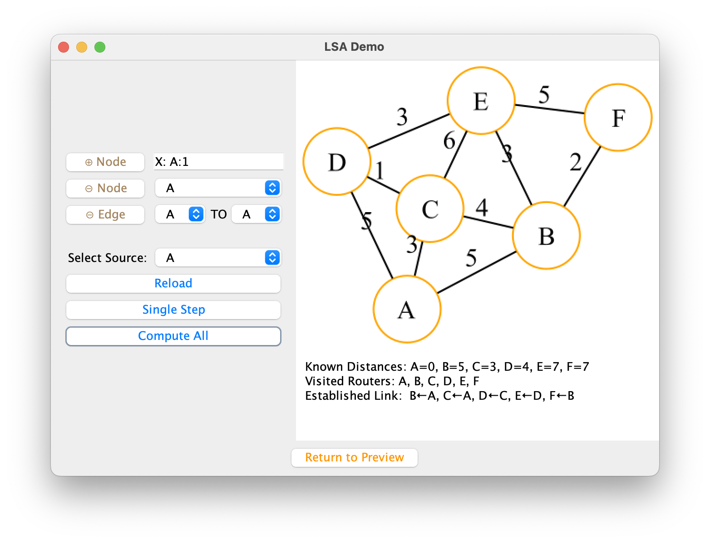
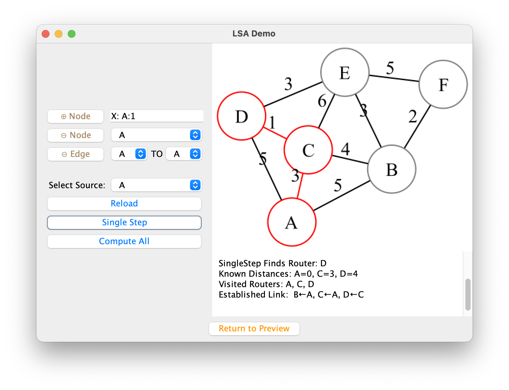
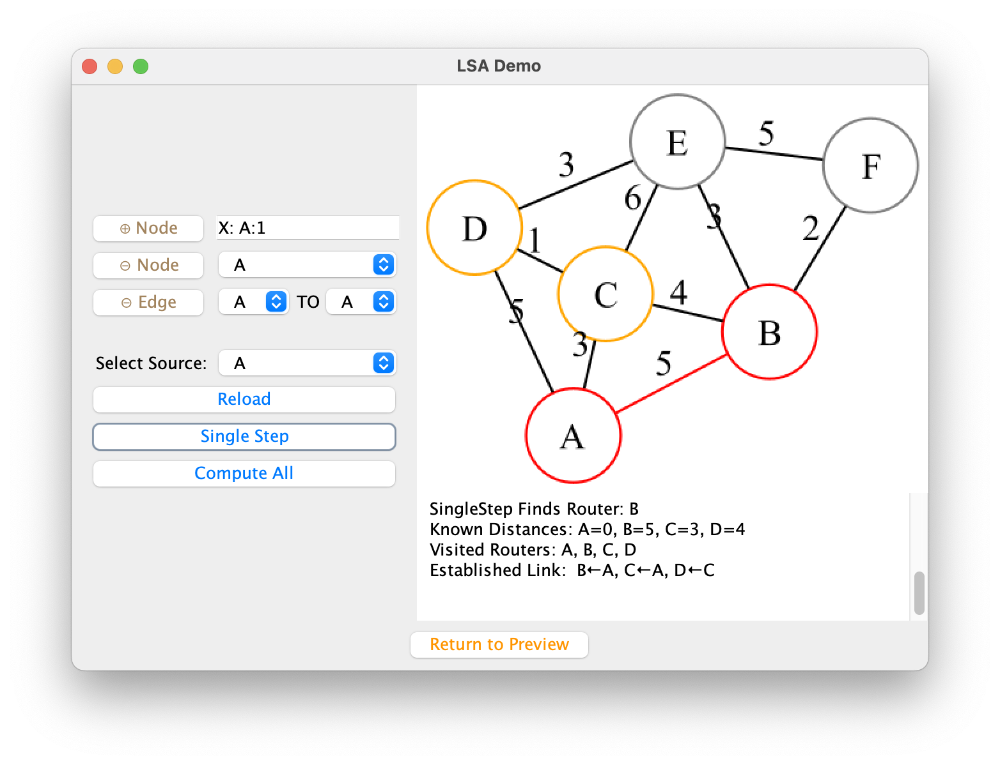
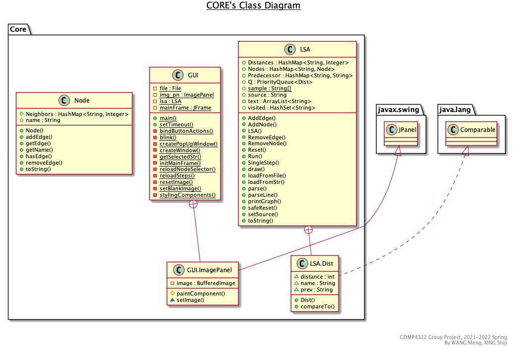

# LSA Sim

A GUI application in Java for simulating LSA (Link State Advertisements). 

*This project is a part of course COMP4322, Fall 2022, HKPolyU.*

## Demo

Initialize the topography of the network from text file. Support step, compute all, reload for LSA.

## Implementation

## LICENSE

[GNU License](LICENSE)